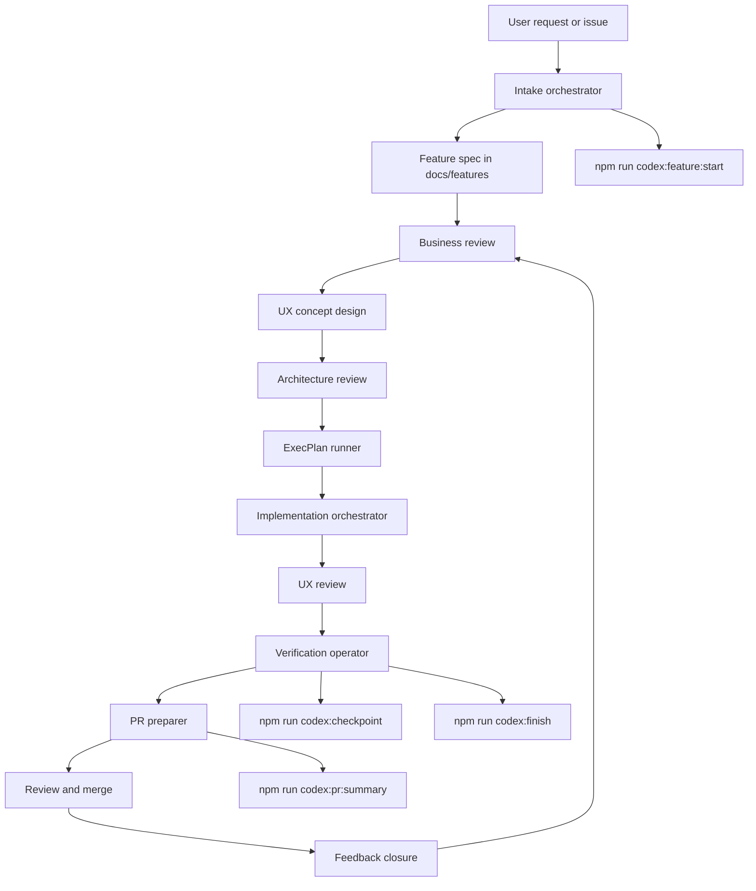
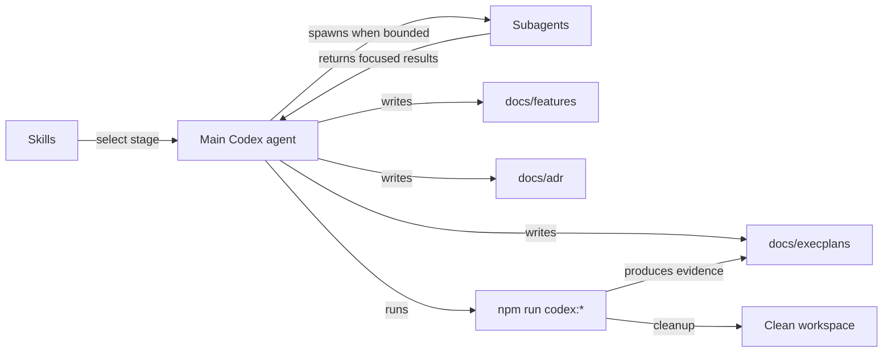

# AI-native SDLC and PDLC workflow

This repository uses an AI-native delivery model where Codex owns the operational path from intake through review handoff. The workflow is layered so that process, execution, and deterministic automation stay separate:

- Skills define stage behavior and artifact expectations.
- Subagents execute bounded parallel tasks inside a stage.
- `npm run codex:*` commands handle repeatable mechanics such as scaffolding, validation, cleanup, and PR summary generation.

## Operating model

The main agent stays responsible for stage transitions, repository state, and final decisions. Subagents are optional helpers for narrow tasks such as codebase exploration, test-gap discovery, or implementation of a disjoint slice.

Specialist review remains explicit:

- `business-reviewer` tightens feature intent and acceptance criteria.
- `ux-concept-designer` defines the intended user experience before UI work is built.
- `architecture-reviewer` checks long-lived technical consequences.
- `ux-reviewer` checks the implemented experience before handoff.

## Lifecycle map

## Control map

## Stage responsibilities

- Intake: create or normalize the feature spec, ADR need, branch linkage, and ExecPlan starting point.
- Feature shaping: make the scope and acceptance criteria implementation-ready.
- UI and UX concept design: define the flow, screens, states, responsive behavior, and accessibility expectations for user-facing work.
- Architecture review: record the technical boundaries that future work must preserve.
- ExecPlan maintenance: keep the delivery plan restartable and current.
- Implementation: deliver the next useful slice and update nearby tests.
- UI and UX review: assess the implemented experience for usability, consistency, responsiveness, and accessibility.
- Verification: run the smallest relevant validation while iterating, then broader checks before handoff.
- PR preparation: generate a review-ready summary and metadata evidence.
- Feedback closure: apply review or CI feedback and update process artifacts when the workflow itself learns something.

## Skill set in this repository

- `.codex/skills/delivery-orchestrator/`
- `.codex/skills/intake-orchestrator/`
- `.codex/skills/ux-concept-designer/`
- `.codex/skills/execplan-runner/`
- `.codex/skills/implementation-orchestrator/`
- `.codex/skills/ux-reviewer/`
- `.codex/skills/verification-operator/`
- `.codex/skills/pr-preparer/`
- `.codex/skills/business-reviewer/`
- `.codex/skills/architecture-reviewer/`

## Default execution sequence

1. Start with `delivery-orchestrator`.
2. Use `intake-orchestrator` to create the repo artifacts if they do not exist.
3. Apply `business-reviewer` when the work is underspecified.
4. Use `ux-concept-designer` before implementing user-facing changes.
5. Apply `architecture-reviewer` when the work changes long-lived technical boundaries.
6. Keep the active ExecPlan current with `execplan-runner`.
7. Use `implementation-orchestrator` for the current delivery slice.
8. Use `ux-reviewer` for user-facing changes before final validation.
9. Run `verification-operator` before closing a slice or opening review.
10. Finish with `pr-preparer`.

## Artifact contract

- `docs/features/*.md` stores the problem statement, scope, and acceptance criteria.
- `docs/adr/*.md` stores durable technical decisions.
- `docs/execplans/*.md` stores the living execution state.
- `docs/design/*.md` stores UI and UX notes for significant user-facing changes.
- `src/` and `tests/e2e/` store implementation and validation coverage.
- `.codex/tmp/pr-summary.md` stores the current review handoff draft.
