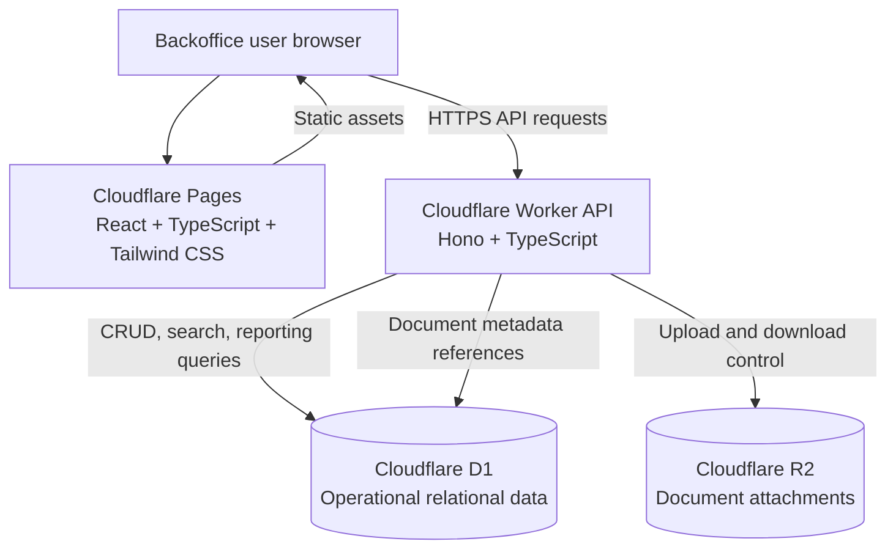

# MVP architecture

## Objective

Define a deployable MVP architecture for the Student Journey Tracking Application using Cloudflare services on the free tier, TypeScript across frontend and backend, and Tailwind CSS for UI styling.

## Architecture principles

- Keep the MVP deployable as a small number of services.
- Favor managed Cloudflare services to reduce operational overhead.
- Use one relational source of truth for operational data.
- Keep the frontend and backend in TypeScript to reduce context switching.
- Treat document uploads as a separate storage concern from transactional student data.
- Defer non-essential distributed components until usage proves the need.

## MVP technology choices

- Frontend: React with TypeScript, built with Vite, styled with Tailwind CSS.
- Frontend hosting: Cloudflare Pages.
- Backend API: Cloudflare Workers using TypeScript.
- API framework: Hono for lightweight routing, middleware, validation, and HTTP handling.
- Primary database: Cloudflare D1 for student records, stages, tasks, cases, interactions, alerts, audit data, and configuration reference data.
- Document storage: Cloudflare R2 for student and case attachments.
- Authentication and session handling: Worker-managed sessions with HttpOnly cookies and role resolution against D1 user and role tables.
- Static asset delivery and edge caching: Cloudflare Pages and Cloudflare CDN.

## Why this fits the MVP

- Pages and Workers keep deployment simple and inexpensive for an early product.
- D1 matches the operational data model better than a document store because the MVP relies on relational reporting, filtering, ownership, and audit history.
- R2 isolates binary document storage from relational data and avoids bloating the transactional database.
- React, TypeScript, and Tailwind CSS give a fast UI delivery path without committing to a complex design system too early.
- A single Worker API avoids premature service splitting while keeping room for future extraction.

## High-level design

- The browser loads a React single-page application from Cloudflare Pages.
- The UI calls a single `/api` surface on a Cloudflare Worker.
- The Worker enforces authentication, role-based access control, validation, and audit logging.
- D1 stores structured operational data.
- R2 stores uploaded document files and related metadata keys stored in D1.
- The same Worker handles document upload coordination, signed access checks, and CRUD operations for the MVP domain.

## Mermaid diagram

## Logical modules

### Frontend

- Student record workspace
- Journey stage and timeline views
- Task and case queues
- Interaction logging views
- Document upload and review views
- Reporting and dashboard views
- Administration views for roles, statuses, queues, and rules

### Backend Worker

- Authentication and session middleware
- Role and scope authorization
- Student records module
- Journey stage workflow module
- Tasks and follow-up module
- Cases and escalation module
- Interaction logging module
- Document metadata and access module
- Alerts, notifications, and reporting query module
- Audit logging module

## Data design for MVP

D1 stores the core operational tables:

- users
- roles
- user_role_assignments
- campuses
- programs
- students
- student_stage_history
- student_assignments
- tasks
- cases
- case_notes
- interactions
- documents
- alerts
- notifications
- risk_flags
- audit_log
- reference_data for statuses, categories, priorities, and reason codes

R2 stores:

- uploaded document binaries
- generated object keys referenced by the `documents` table

## Request flow

### Standard record update

1. The user loads the Pages-hosted application.
2. The frontend calls the Worker API with a secure session cookie.
3. The Worker validates the session and resolves the user's roles and scope.
4. The Worker validates the request payload and business rules.
5. The Worker writes transactional changes to D1.
6. The Worker writes an audit entry for the action.
7. The Worker returns the updated record view model to the UI.

### Document upload

1. The user selects a file from the document UI.
2. The frontend sends upload metadata and file content to the Worker.
3. The Worker checks document permissions and metadata validity.
4. The Worker creates a D1 upload record with a pending status and correlation identifier before writing the file.
5. The Worker stores the file in R2.
6. The Worker stores document metadata, record linkage, and final upload status in D1.
7. The Worker writes an audit entry for the upload.
8. If the R2 write or D1 finalization fails, the Worker records the failure state and error context so support staff can determine whether the upload completed, failed, or needs cleanup.

### Notification creation

1. A task assignment, due-date rule, overdue transition, escalation, or record status change triggers notification logic in the Worker.
2. The Worker evaluates recipient eligibility based on current role, scope, ownership, and follow relationships.
3. The Worker writes an in-app notification record to D1 with notification type, recipient, linked record, trigger event, created date and time, and read status.
4. The frontend reads notifications from the API and allows the user to mark them as read without changing the underlying task, case, or student record.

## Query and indexing approach

- D1 remains the source of truth for transactional data, search filters, queue views, and MVP reporting.
- The MVP schema should add indexes for common operational lookups such as student identifiers, current stage, owner, task status and due date, case status and priority, notification recipient and read status, and audit timestamps.
- Student record views should use targeted queries for related history rather than loading all related data in one unbounded request.
- Search should prioritize exact and prefix lookups on student ID, application ID, email, phone number, and normalized student name fields.
- Queue and dashboard queries should be constrained by campus, program, owner, stage, status, and date filters that match the reporting and RBAC requirements.
- Slow-query thresholds should be logged for operational investigation when search, record view, or queue requests exceed the performance targets defined in the feature specifications.

## Security model for MVP

- All application traffic uses HTTPS.
- Authentication is required before access to any operational screen or API.
- Sessions are stored in secure HttpOnly cookies.
- Session expiry, rotation, and logout invalidation are enforced by the Worker so stale sessions cannot remain active indefinitely.
- Role and scope checks are enforced in Worker middleware and handler logic.
- Permission checks apply consistently across UI actions, API handlers, search results, notifications, reporting, exports, and document access paths.
- Sensitive document access is checked before file access is granted.
- File downloads are served only through Worker-controlled access checks. R2 objects are not exposed through unrestricted public URLs.
- Authentication failures, authorization failures, and sensitive document access events are logged for operational investigation without exposing sensitive data in logs.
- Audit entries are written for create, update, assignment, stage change, permission-sensitive actions, and document access events defined by the feature specs.
- Encryption at rest is provided by platform-managed controls for D1 and R2, while application design limits unnecessary duplication of sensitive student data.

## Reliability and operations for MVP

- The MVP targets business-hour operations with a design goal aligned to the first-release reliability requirements.
- Operational errors are logged with enough context to identify the affected feature, user action, timestamp, and correlation identifier.
- User-facing failures return a clear error message and do not silently discard submitted data.
- Critical workflows such as record updates, case updates, task changes, and document uploads should preserve enough state in D1 to determine whether the action completed after a partial failure.
- Monitoring should cover API failures, repeated authentication failures, slow requests, and unresolved production incidents affecting core student, task, case, and document workflows.

## Data retention and compliance responsibilities

- D1 and R2 data retention rules must be configurable according to campus policy and applied separately to operational records, documents, and audit history where policy requires different retention periods.
- The architecture must support retention review, deletion, or archival workflows without bypassing audit requirements for permission-sensitive actions.
- Documents and audit records should keep enough metadata to support compliance review even when campus policy requires content deletion after a retention period.

## Deployment model

- One Cloudflare Pages project for the frontend.
- One Cloudflare Worker service for the API.
- One D1 database per environment.
- One R2 bucket per environment for document storage.
- Separate environments for local development, preview, and production.

## Expected MVP limitations

- The first release uses a single Worker service rather than separate services per domain.
- Notifications are in-app only for MVP and do not require a separate asynchronous messaging platform.
- Reporting is built from operational D1 queries rather than a separate warehouse.
- Reliability monitoring is operationally focused and lightweight for MVP rather than a full observability platform.
- Very large document workflows, advanced background jobs, and deep analytics are deferred until usage requires them.

## Evolution path after MVP

- Add Cloudflare Queues when notifications, imports, or document post-processing need asynchronous handling.
- Introduce read-optimized reporting patterns if dashboard demand outgrows direct D1 querying.
- Split the Worker into smaller services only when team size, deployment cadence, or scaling patterns justify the cost.
- Add stronger identity federation if campus SSO becomes a product requirement.
